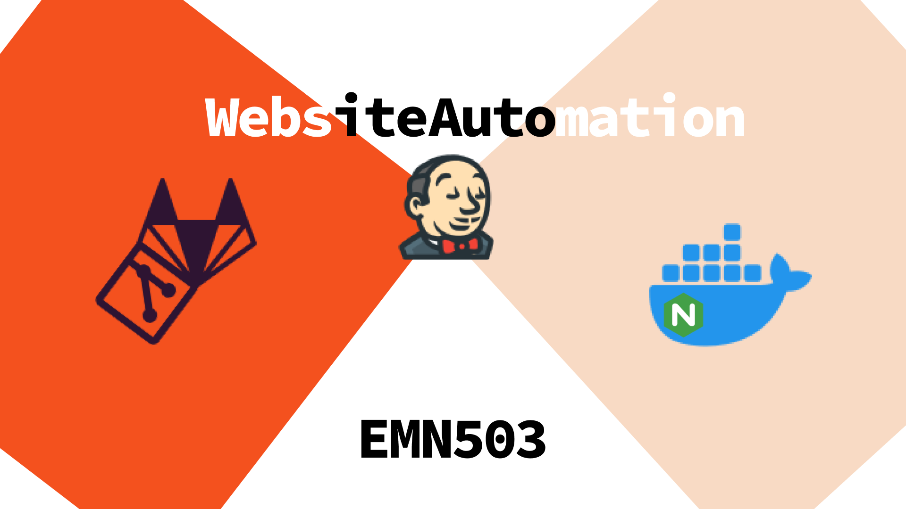

## Jenkins Basic Website Automation Project 🧑🏻‍💻

**Let's talk about the project**

    This project was completed in 3 steps.
    
    1. Server Configuration with Nginx
    2. Container Initialising with docker-compose
    3. Jenkins Configuration

You can subscribe to my profile to stay updated